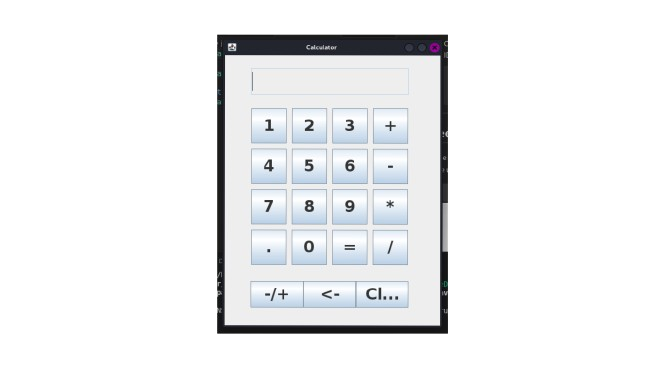

# Calculator Applications

This repository contains two simple calculator applications: one built using Python (with the Kivy framework) and another built using Java (with the Swing framework). Each calculator allows users to perform basic arithmetic operations such as addition, subtraction, multiplication, and division, along with a few additional features.

## Contents
- [Python Calculator (Kivy)](#python-calculator-kivy)
- [Java Calculator (Swing)](#java-calculator-swing)

---

## Python Calculator (Kivy)

### Overview
A calculator application built using the Kivy framework that supports basic arithmetic operations and additional functionality like sign toggling and backspace.

### Features
   - Basic arithmetic operations (Addition, Subtraction, Multiplication, Division)
   - Clear button to reset the calculator
   - Positive/negative toggle button to change the sign of a number
   - Backspace button to erase the last digit
   - Parentheses button to handle operations with parentheses

### Usage
1. Enter numbers using the number buttons (0-9).
2. Use the operation buttons (+, -, *, /) to perform calculations.
3. Press the "C" button to clear the calculator.
4. Use the "+/-" button to toggle between positive and negative numbers.
5. Press the "<-" button to erase the last digit.
6. Use the parentheses button to add parentheses to the expression.

### Installation
To run the Python calculator, make sure you have Python installed. Then, install the necessary dependencies:

```bash
pip install -r requirements.txt
```

After installing the requirements, run the app:

```bash
python main.py
```

### Requirements
- Python 3.6+
- Kivy 2.3.0

---

## Java Calculator (Swing)

### Overview
A calculator application built using Java Swing that provides basic arithmetic operations and additional functionality such as handling decimal numbers, value negation, and clearing input.

### Features
   - Addition, subtraction, multiplication, and division
   - Decimal operations
   - Positive/negative value toggle
   - Clear and delete functionalities

### Prerequisites
To run the Java calculator, you will need:
- Java Development Kit (JDK)
- Any Java IDE (IntelliJ IDEA, Eclipse) or a text editor and command line

### Installation
1. Clone the repository:
   ```bash
   git clone https://github.com/ThaboChauke/Calculators.git
   ```

2. Navigate to the Java calculator directory:
   ```bash
   cd java-calculator
   ```

3. Compile and run the `Main.java` file from your preferred IDE or using the command line:
   ```bash
   javac Main.java
   java Main
   ```

---

## Screenshots
Include screenshots of both the Python and Java calculators here to give users a visual reference of the apps.




---