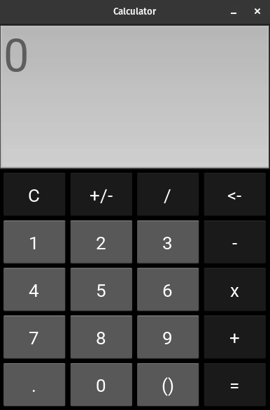

# Calculator App

This is a simple calculator app built using the Kivy framework. It allows users to perform basic arithmetic operations such as addition, subtraction, multiplication, and division.

## Features

   - Addition, subtraction, multiplication, and division operations
   - Clear button to reset the calculator
   - Positive/negative toggle button to change the sign of the number
   - Backspace button to erase the last digit
   - Parentheses button to add parentheses to the expression

## Usage

   - Enter numbers using the number buttons (0-9).
   - Use the operation buttons (+, -, *, /) to perform calculations.
   - Press the "C" button to clear the calculator.
   - Use the "+/-" button to toggle between positive and negative numbers.
   - Press the "<-" button to erase the last digit.
   - Use the parentheses button to add parentheses to the expression.

## Installation

To run the app, make sure you have Python installed on your system. Then, install the requirements using pip:

 - pip -r install requirements.txt

After installing Kivy, you can run the app by executing the main.py file:

 - python main.py

## Requirements

    Python 3.6+
    Kivy 2.3.0

## Screenshots

